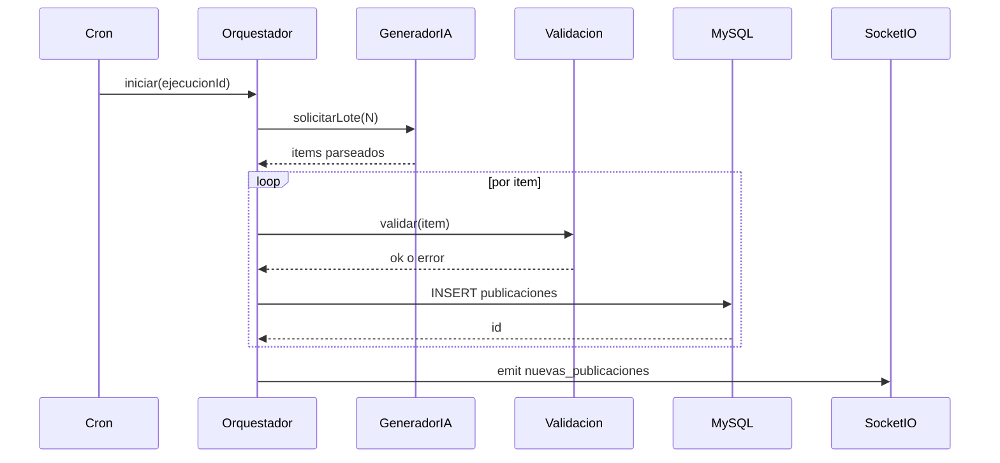

# Diseño técnico — Pipeline de generación IA

## Referencia

El contrato funcional y evolutivo está en `requirements.md`. Este archivo resume **secuencia** y **puntos de extensión**.

## Secuencia (estado objetivo)

## Estado actual (código)

- Orquestador: `backend/src/services/orquestadorGeneracionIA.servicio.ts` (4 items por ciclo).
- Cron local: `cronGenerador.ts` — al arrancar `server.ts` ejecuta un ciclo; luego `0 * * * *`.
- Vercel: `GET /api/cron/generar-ia` (header `x-vercel-cron` o `Authorization: Bearer CRON_SECRET`); definido en `vercel.json` → `crons`.
- Semilla deploy: `middlewareSemillaDespliegue` — primer request con `VERCEL_DEPLOYMENT_ID` nuevo → un ciclo; marca en tabla `estado_sistema`.
- Emisión socket: solo si hay inserts y corre `server.ts` con Socket.IO activo.

## Puntos de extensión

- Mutex de job: variable en módulo o `redis lock` en fase distribuida.
- Emisión parcial: lista de ids insertados en la misma ejecución.
