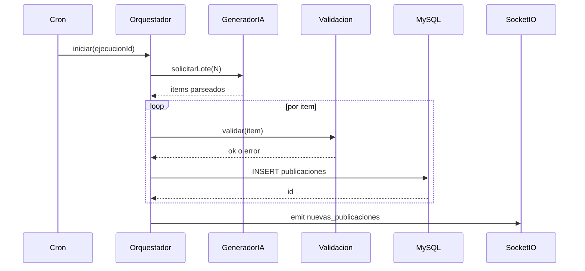

# Diseño técnico — Pipeline de generación IA

## Referencia

El contrato funcional y evolutivo está en `requirements.md`. Este archivo resume **secuencia** y **puntos de extensión**.

## Secuencia (estado objetivo)

## Estado actual (código)

Hoy: `cronGenerador.ts` orquesta de facto y llama `procesarLotePublicacionesIA`; emite `nuevas_publicaciones` tras resultado. La extracción a `orquestadorGeneracionIA.servicio.ts` es refactor mecánico + invariantes de orden.

## Puntos de extensión

- Mutex de job: variable en módulo o `redis lock` en fase distribuida.
- Emisión parcial: lista de ids insertados en la misma ejecución.
