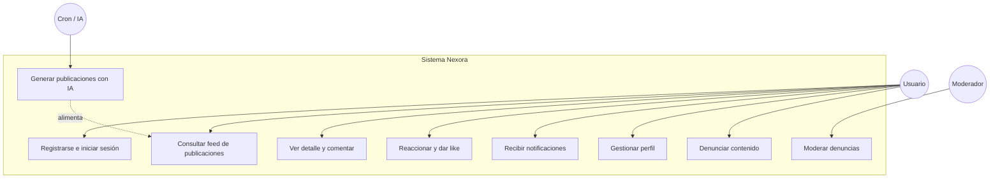
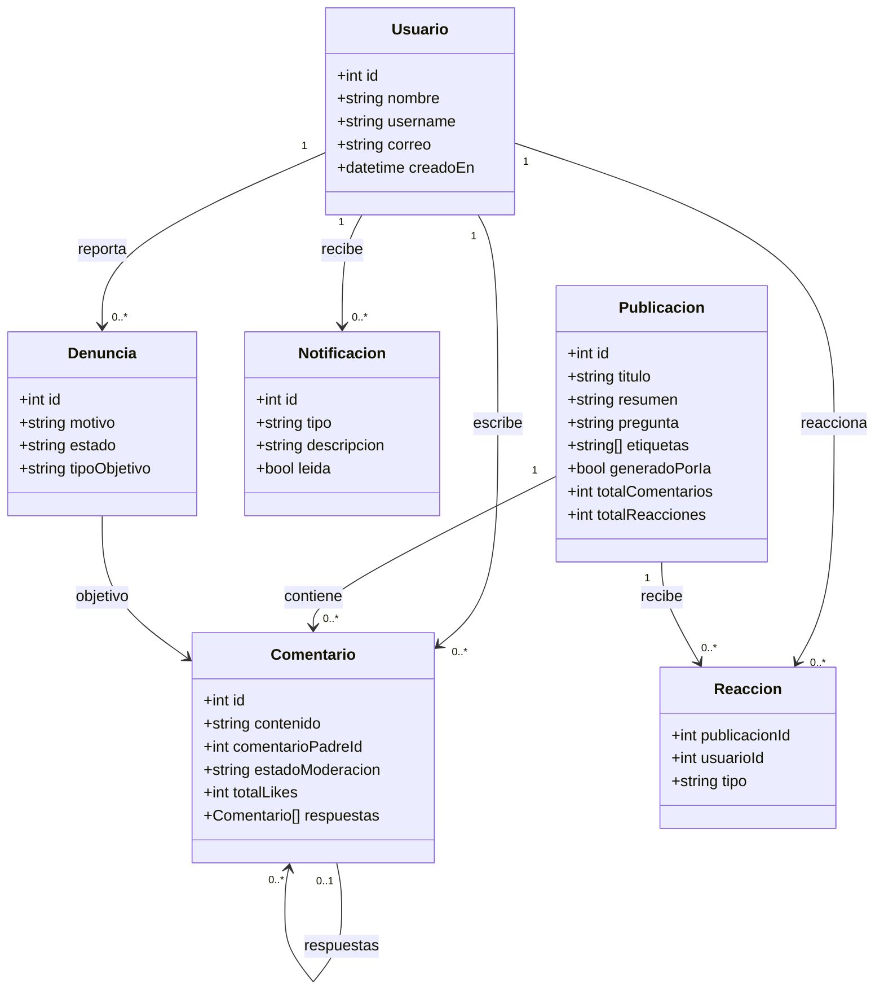
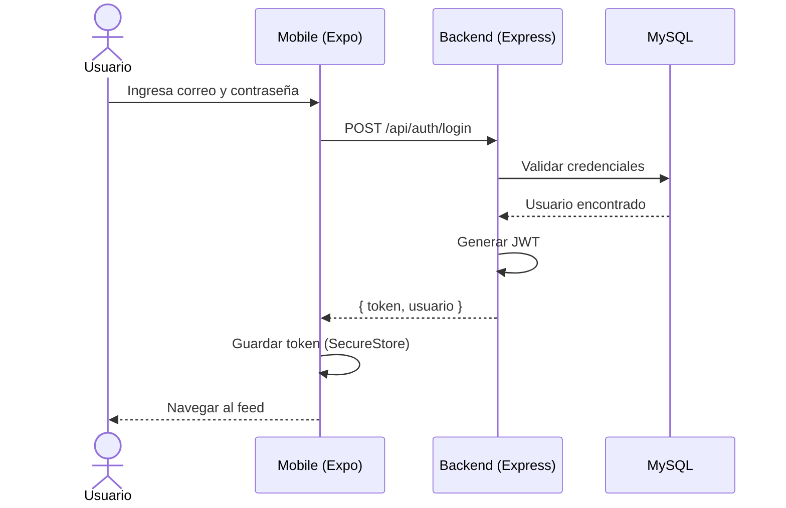
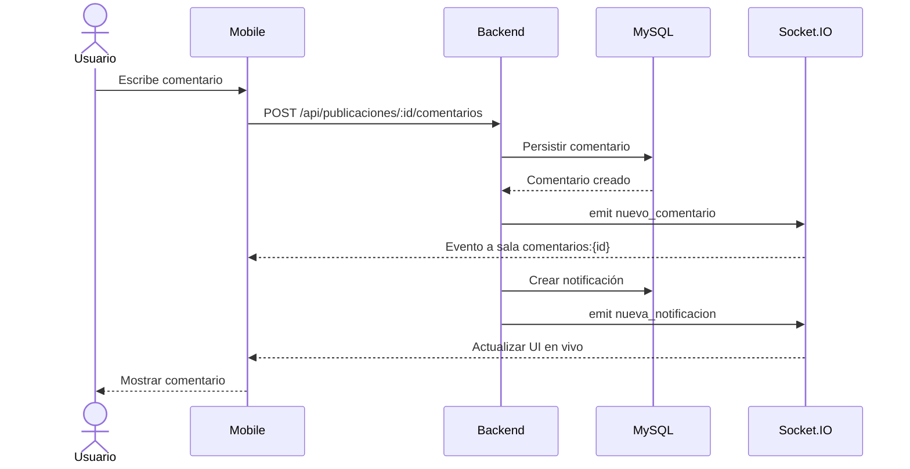
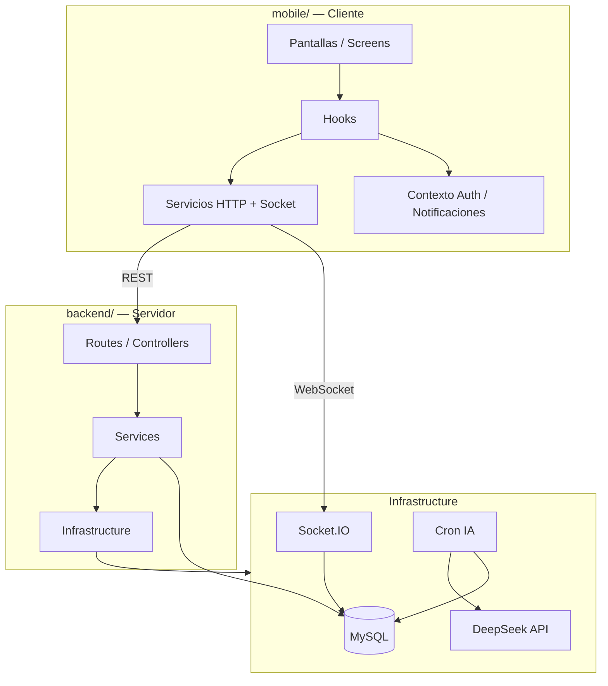

# Nexora

## Descripción

Nexora es una red social tipo foro enfocada en tecnología, programación e innovación. Las publicaciones del feed se generan automáticamente mediante IA (DeepSeek API): 4 posts al arrancar el servidor o desplegar, y 4 adicionales cada hora. Los usuarios no crean publicaciones; interactúan mediante comentarios, reacciones, likes y debate en tiempo real.

## Integrantes

- Eliecer Guevara Fuentes
- Erick Sebastián Pérez Carvajal

## Tecnologías

- **Framework:** React Native + Expo
- **Lenguaje:** TypeScript (mobile y backend)
- **Versión SDK:** Expo ~54.0.33 · React Native 0.81.5 · Node.js LTS
- **Backend:** Express + MySQL + Socket.IO + node-cron
- **Estilos:** NativeWind (Tailwind CSS)
- **API consumida:** API REST propia (`http://localhost:4010` en local · [nexora-ruddy-nine.vercel.app](https://nexora-ruddy-nine.vercel.app/) en producción) + DeepSeek API (generación de contenido)

## Arquitectura

Monorepo con dos proyectos independientes que se comunican solo por REST y WebSockets:

```
┌──────────────┐          ┌──────────────────────────┐
│   mobile/    │◄────────►│       backend/           │
│ React Native │  REST +  │  Node.js + Express       │
│    + Expo    │ Socket.IO│  + MySQL + Socket.IO     │
└──────────────┘          └──────────┬───────────────┘
                                     │
                          ┌──────────▼──────────┐
                          │   DeepSeek API (IA)  │
                          │   Cron cada hora     │
                          └─────────────────────┘
```

**Estructura del repositorio:**

```
nexora/
├── mobile/      — Aplicación React Native (Expo)
├── backend/     — API REST + WebSockets + Cron Jobs
├── docs/        — Documentación técnica
└── docker-compose.yml
```

Documentación detallada: [docs/arquitectura.md](docs/arquitectura.md)

## Especificaciones Funcionales

- [x] **Autenticación:** registro, inicio de sesión y verificación de token JWT
- [x] **Feed de publicaciones:** listado paginado con contenido generado por IA
- [x] **Detalle de publicación:** vista completa con comentarios anidados
- [x] **Comentarios y reacciones:** crear, eliminar, likes y respuestas en tiempo real
- [x] **Notificaciones:** alertas in-app con actualización en tiempo real vía Socket.IO
- [x] **Perfil de usuario:** perfil propio, perfil público e historial de comentarios
- [x] **Moderación:** denuncias de contenido y panel para moderadores
- [x] **Generación IA:** pipeline automático con DeepSeek (cron horario + semilla al arrancar)
- [x] **Tiempo real:** nuevas publicaciones, comentarios y notificaciones vía WebSocket
- [x] **Observabilidad:** endpoints de salud (`/api/salud`, `/api/salud/listo`, `/api/salud/vivo`)

## Instalación y Ejecución

### Requisitos previos

- Node.js LTS y npm
- Git
- Docker (recomendado para MySQL)
- Expo Go en el celular o emulador Android/iOS

### 1. Clonar el repositorio

```bash
git clone https://github.com/Erickpe8/Nexora.git
cd Nexora
```

### 2. Base de datos (MySQL con Docker)

```bash
docker-compose up -d
docker-compose ps
```

Credenciales: usuario `nexora_user`, contraseña `nexora_pass`, base de datos `nexora`, puerto **3307**.

### 3. Backend

```bash
cd backend
cp .env.example .env        # configurar variables de entorno
npm install
npm run tablas              # primera vez (o npm run migrar si la BD ya existe)
npm run dev                 # servidor en http://localhost:4010
```

### 4. Mobile

```bash
cd mobile
cp .env.example .env        # configurar EXPO_PUBLIC_API_URL
npm install
npm start                   # Expo Go, emulador Android o iOS Simulator
```

> **Importante:** en `mobile/.env`, `EXPO_PUBLIC_API_URL` debe apuntar a la **IP LAN** de tu máquina (no `localhost`) si usas Expo Go en un dispositivo físico. El backend imprime las IPs disponibles al arrancar.

### Atajos de Expo

| Tecla | Acción |
|-------|--------|
| `a` | Abrir en emulador Android |
| `w` | Abrir en navegador web |
| QR | Escanear con Expo Go |

## Diagramas UML

### Diagrama de casos de uso



### Diagrama de clases (dominio principal)



### Diagrama de secuencia — Inicio de sesión



### Diagrama de secuencia — Comentario en tiempo real



### Diagrama de componentes



## Servicios Web Consumidos

| Método | Endpoint | Descripción |
|--------|----------|-------------|
| `GET` | `/api/salud` | Estado del servidor, versión y conexión MySQL |
| `GET` | `/api/salud/listo` | Liveness — proceso vivo |
| `GET` | `/api/salud/vivo` | Readiness — MySQL responde |
| `POST` | `/api/auth/registro` | Crear cuenta de usuario |
| `POST` | `/api/auth/login` | Iniciar sesión |
| `GET` | `/api/auth/verificar` | Verificar token JWT activo |
| `GET` | `/api/publicaciones` | Feed paginado de publicaciones |
| `GET` | `/api/publicaciones/:id` | Detalle de una publicación |
| `GET` | `/api/publicaciones/:id/comentarios` | Comentarios de una publicación |
| `POST` | `/api/publicaciones/:id/comentarios` | Crear comentario o respuesta |
| `DELETE` | `/api/comentarios/:id` | Eliminar comentario propio |
| `POST` | `/api/comentarios/:id/denuncias` | Denunciar un comentario |
| `GET` | `/api/notificaciones` | Últimas notificaciones del usuario |
| `PATCH` | `/api/notificaciones/leer-todas` | Marcar todas como leídas |
| `PATCH` | `/api/notificaciones/:id/leida` | Marcar una notificación como leída |
| `GET` | `/api/usuarios/perfil` | Perfil propio con estadísticas |
| `PATCH` | `/api/usuarios/perfil` | Actualizar nombre de perfil |
| `GET` | `/api/usuarios/:id` | Perfil público de un usuario |
| `GET` | `/api/usuarios/:id/comentarios` | Historial de comentarios del usuario |
| `GET` | `/api/moderacion/denuncias` | Lista de denuncias (moderadores) |
| `PATCH` | `/api/moderacion/comentarios/:id` | Ocultar o restaurar comentario |
| `POST` | `/api/interno/ia/generar` | Disparo manual del pipeline IA (interno) |

**WebSockets (Socket.IO):** `nuevas_publicaciones`, `nuevo_comentario`, `comentario_eliminado`, `nueva_notificacion`, entre otros. Ver [backend/README.md](backend/README.md).

## Conclusiones

Durante el desarrollo de Nexora el equipo aplicó una arquitectura monorepo con separación estricta entre cliente móvil y backend, lo que facilitó escalar cada capa de forma independiente. La integración de IA para generar contenido automático permitió construir un feed dinámico sin depender de publicaciones manuales, mientras Socket.IO aportó interactividad en tiempo real para comentarios y notificaciones.

El uso de TypeScript en ambas capas, convenciones en español y documentación viva en `.kiro/` y `docs/` ayudó a mantener coherencia entre módulos (autenticación, feed, moderación, observabilidad). El despliegue en Vercel con MySQL en Railway demostró cómo adaptar un backend con cron y WebSockets a un entorno serverless parcial.

---

**Documentación adicional:** [docs/README.md](docs/README.md) · [docs/onboarding.md](docs/onboarding.md) · [docs/DEPLOY-VERCEL.md](docs/DEPLOY-VERCEL.md)
